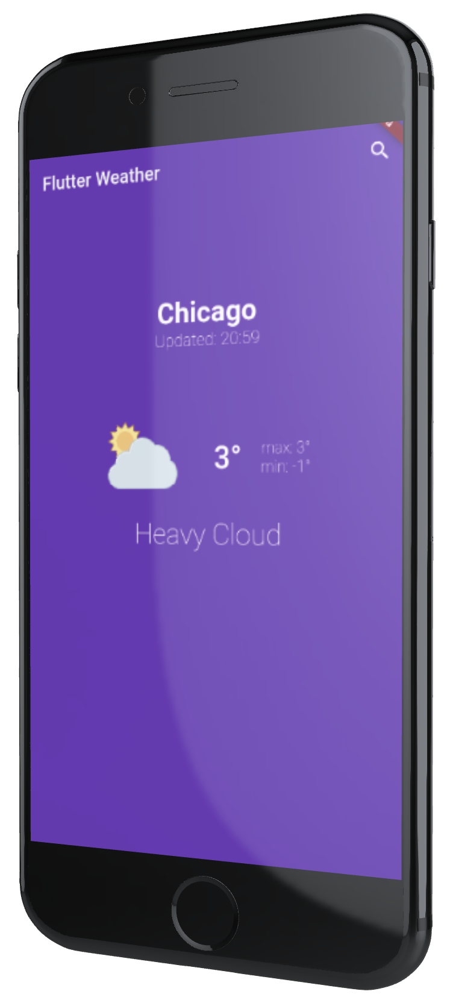

<h1 align="center">
  ☁ Weather app
</h1>

<h2 align="center">
  A weather app created with flutter and bloc pattern
</h2>

<br />
<br />

<h3 align="center">
  
  
</h3>

## Used Packages

- ✨ equatable
- ✨ flutter_bloc
- ✨ http

## How to run

1. First clone the repo:

```bash
git clone https://github.com/KauaLimaMartins/Weather-app-flutter-bloc.git
```

<br />

2. In the repo path:

```bash
flutter pub get
```

<br />

3. And finally:

```bash
flutter run
```
